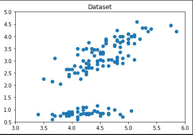
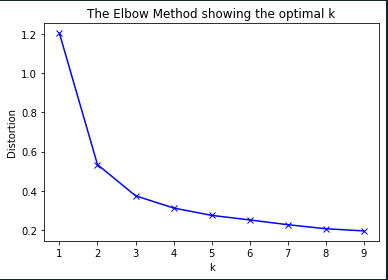
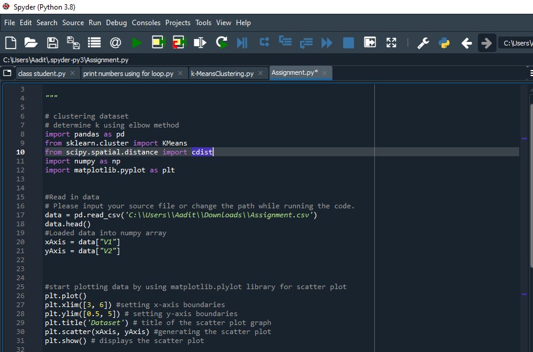
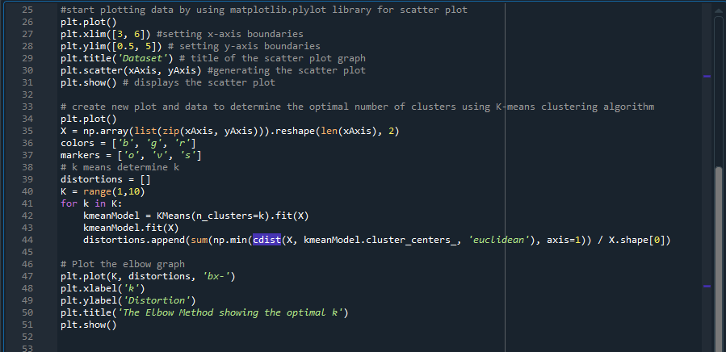

# ACM Research Coding Challenge (Fall 2020) 
## Author: Aadit Meenege

As I started my research, I first learned about the difference between supervised and unsupervised learning. In supervised learning algorithms, data is labeled and helps predict outcomes for unforeseen outcomes; however, it mainly deals with unlabelled data in unsupervised learning. It can be unpredictable, but it finds most unknown patterns in data. This current project or coding challenge would be an example of unsupervised learning because we are not making any predictions instead we are determining the number of clusters. After deciding whether it's supervised or unsupervised, I researched into ten different types of clustering algorithms. K means clustering is the most widely used algorithm for clustering and assigns examples to clusters to reduce each cluster's variance. This example code fits the model on the dataset, and then a scatter plot is created with points in the “ClusterPlot.csv” dataset. 

 

There are multiple methods to determine the optimal number of clusters for the data, but the Elbow method is consistent and designed to help find the number of clusters in the data set. I copied the example code to find the optimal value for K and has roughly **3 to 4 clusters** on the data set. 

 

Throughout the code, I used five libraries called **pandas, numpy, matplotlib.pyplot, sklearn.cluster, and scipy.spatial.distance to cluster or plot the data set, and determine the number of clusters (k) using the Elbow method**. Additionally, while running the code, please change the source file path in file read statement (line 17). Comments are added to the code for readability. 

Note: Below code also copied to Git. 

 

 

 The following sources are listed below.

1. “Supervised vs Unsupervised Learning: Key Differences.” Guru99, https://www.guru99.com/supervised-vs-unsupervised-learning.html

2. Huneycutt, Jake. “An Introduction to Clustering Algorithms in Python.” Medium, Towards Data Science, 29 May 2018, https://towardsdatascience.com/an-introduction-to-clustering-algorithms-in-python-123438574097 

3. Brownlee, Jason. “10 Clustering Algorithms With Python.” Machine Learning Mastery, 20 Aug. 2020, https://machinelearningmastery.com/clustering-algorithms-with-python/ 

4. Seif, George. “The 5 Clustering Algorithms Data Scientists Need to Know.” Medium, Towards Data Science, 14 Sept. 2019, https://towardsdatascience.com/the-5-clustering-algorithms-data-scientists-need-to-know-a36d136ef68 

5. Asarudheen, Mohamed. “4 Best Ways to Find Optimal Number Of Clusters for Clustering - With Python Code.” Medium, Medium, 9 Sept. 2019, https://medium.com/@masarudheena/4-best-ways-to-find-optimal-number-of-clusters-for-clustering-with-python-code-706199fa957c 

6. Alade, Tola. “Tutorial: How to Determine the Optimal Number of Clusters for k-Means Clustering.” Medium, Cambridge Spark, 23 Dec. 2019, https://blog.cambridgespark.com/how-to-determine-the-optimal-number-of-clusters-for-k-means-clustering-14f27070048f 
